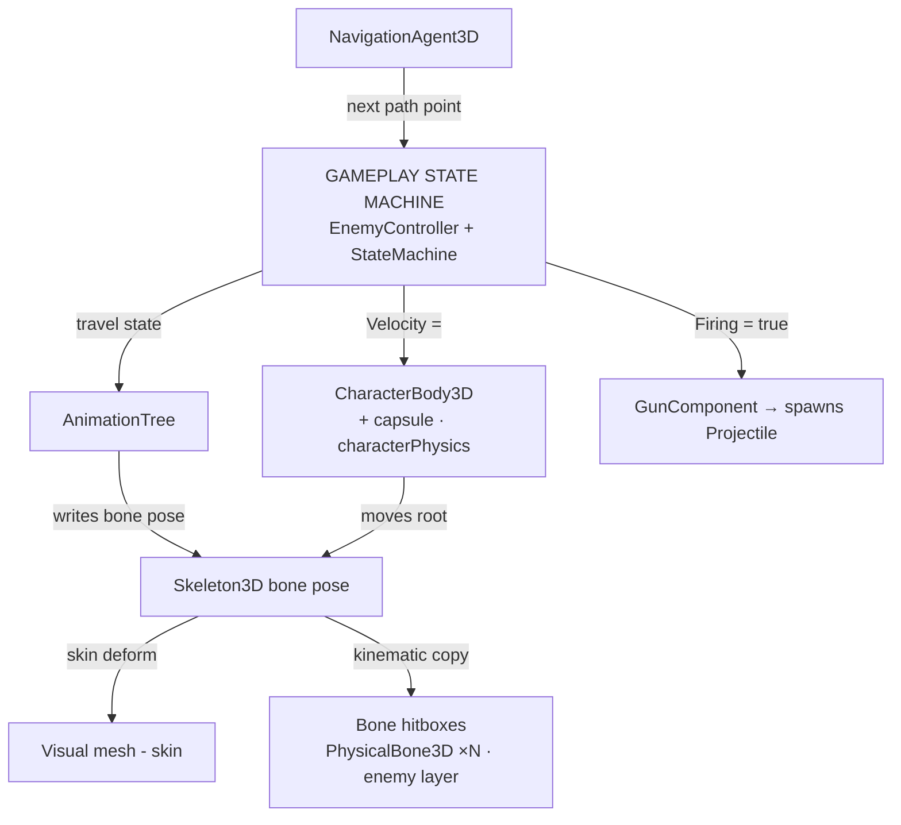

# Rigged Character Pipeline — Blender to Godot 4

*A build-order field guide, grounded in the Grunt enemy in this repo.*
*Format: Blender -> glTF 2.0 -> Godot 4.x. Originally published as a Claude artifact: https://claude.ai/code/artifact/cae0f7ca-2814-4be9-87ab-3d1115291f41*

## Why this feels like too much

Every tutorial you'll find teaches one of these systems in isolation, using a placeholder capsule. The moment you swap in a *real* rigged character, all nine show up on the same object at once, and it reads as one tangled problem instead of nine small ones.

It isn't one problem. Look at what actually talks to what: one decision-maker, three narrow outputs, one shared pose, two things reading that pose. Nothing on the right needs to know anything about anything on the left. That's the whole trick — build each box once, prove it works on its own, and the wiring between them stays this thin the entire time.

How the pieces actually talk once everything below is built. This is the *runtime* shape — the sections that follow are ordered by *build* order instead, which is different and matters more while you're the one doing the building.

### The one idea worth remembering

Build order and talk order are different things, and conflating them is most of the overwhelm. Nothing below depends on the animation state machine existing yet. Nothing depends on the gameplay state machine existing yet, either — a hitbox is a fact about a skeleton, full stop. Build bottom-up, verify each layer in isolation before the next one leans on it, and by the time you reach the two state machines at the top, everything they're driving already works whether or not they exist.

## 00 — Blender hygiene

Everything Godot gets wrong about a rig traces back to something Blender exported wrong. Fix it here, once, and it stays fixed for every future export.

### Before you touch export

- **Apply all transforms.** Select the mesh and the armature, `Ctrl+A` → *All Transforms*, on both. This is the single highest-value fix on this whole page — Blender visually compensates for un-applied position/rotation/scale, glTF bakes those raw values in literally, and Godot renders exactly what it's told with no compensation. Skip this and you get twisted rest poses, limbs rotated onto the wrong axis, or a character sized nothing like what you saw in Blender.
- **Recalculate bone roll.** In Edit Mode, select all bones → *Armature → Bone Roll → Recalculate Roll* (Global +Z is a safe default). Inconsistent roll is the other common cause of "this one limb twists wrong," separate from the transforms issue above.
- **Push every Action to an NLA strip and rename the strip.** A loose Action sitting in the Action Editor is not reliably exported. Select the armature, open the NLA editor, push each finished Action down, and rename the resulting strip to exactly what you want the animation called in Godot (`idle`, `walk`, `attack`, `staggered`...). The strip name is what Godot's AnimationPlayer will show.
- **Give every action a Fake User** (the shield icon in the Action Editor) so Blender doesn't garbage-collect an Action that isn't currently on an NLA strip.
- **Suffix looping animations with `-loop`** (e.g. `walk-loop`). Godot's glTF importer reads that suffix and sets the animation's loop mode; without it, a walk cycle plays once and stops.
- **Keyframe frame 0 explicitly** on every bone for your idle animation, so Godot doesn't interpolate from the bind pose into your first real keyframe — that interpolation reads as a pop or a slide on loop.
- **Normalize vertex weights across deforming groups only.** glTF exports a maximum of 4 bone weights per vertex. If you have non-deform vertex groups (a "smoothing" or "physics" helper group), strip or exclude them before normalizing, or they eat into that 4-slot budget.
- **Name things.** `Armature.003` and `Cube.017` are how you end up guessing later which node is the one you actually want in an inherited scene with forty children.

> **Why it matters downstream**
>
> Every export-side mistake here surfaces as an import-side symptom two or three layers later, disconnected enough from the cause that it's genuinely hard to trace back. A twisted rest pose *looks like* a Godot bug. It's almost never a Godot bug.

## 01 — Import & the yellow-node rule

The one decision that determines whether every layer after this one survives you going back into Blender and changing something.

### Export settings

- `File → Export → glTF 2.0 (.glb)`. Format: glTF Binary is simplest for a single-file asset.
- Transform: Scale `1.0`, `+Y Up` checked (Godot is Y-up; Blender is Z-up, and the exporter does this conversion for you — don't also rotate the armature by hand to compensate, that's a second wrong fix stacked on the exporter's correct one).
- Data → Mesh: *Apply Modifiers* on.
- Animation: *NLA Strips* checked, *Export all animation actions* unchecked — otherwise every stray test action you never deleted rides along into Godot's animation list.

### Getting it into Godot without losing the link

A `.glb` is a source asset, not something Godot expects you to hand-edit. The question is how to add game-specific nodes — collision shapes, scripts, a Components container — on top of it, in a way that survives you re-exporting from Blender next week.

- **Right way:** drag the `.glb` into a scene as an instance (or right-click it → *New Inherited Scene*). Nodes that came from Blender show up tinted, marking them as still linked to the source file. Add your new nodes as siblings/children of that instance — those additions live in the instance, not the source, so a reimport keeps them.
- **Wrong way:** "Make Local" or duplicating the imported scene. This breaks the connection outright — reimporting the `.glb` after that does nothing for this copy ever again.
- **Root type override:** double-click the `.glb` in the FileSystem dock → Import tab → Advanced → Scene → *Root Type*, set it to `CharacterBody3D` (or whatever the object actually is), then reimport. Do this *before* you add anything on top, and do it here — not by right-clicking the root inside the inherited scene and choosing *Change Type*, which severs the same link "Make Local" does.

> **In this project**
>
> `Assets/Blender/gruntBasicEnemy.glb.import` sets `nodes/root_type="CharacterBody3D"` — that's what makes the scene's root already a physics body with no script needed just to exist as one. `Enemy/Grunt/grunt_basic_enemy.tscn` is exactly the inherited-scene pattern above: `instance=ExtResource(...glb)`, with the movement capsule and every hitbox added as siblings on top.

> **Gotcha**
>
> If a reimport follows a structural change in Blender (a bone renamed, a mesh split differently), spot-check the scene tree afterward. Godot's importer can occasionally carry a child onto a differently-named node that merely looks similar — this is rare, but it's exactly the kind of thing that only shows up three sessions later as "why is this collision shape on the wrong bone now."

## 02 — Skeleton & mesh

The one piece of shared truth every other system either reads from or writes to: where every bone currently is.

### What's actually there

- `Skeleton3D` holds the bone hierarchy and the current pose. `AnimationPlayer` tracks target it by bone name — that's the entire mechanism of skeletal animation in Godot, nothing more exotic than "this track drives that bone's transform."
- `MeshInstance3D` is skin-bound to the skeleton through a `Skin` resource, which is why the visual mesh isn't a free node you can casually reparent — it's referencing bone indices.
- `BoneAttachment3D` is for anything that should track exactly one bone rigidly, without deforming — a held weapon, a hat, a shoulder pad. It's a different mechanism from skinning: one bone's transform, copied outward, not blended across several.

### The mistake that only shows up on a real rig

A capsule placeholder's mesh is a direct top-level child, so `GetNode<MeshInstance3D>("MeshInstance3D")` in a script works fine and looks like a totally reasonable thing to hardcode. A rigged character's mesh is nested wherever the armature import put it — often several levels under the skeleton — and that hardcoded lookup throws the instant you point the same script at the real character. Make the reference an `[Export]` instead, with the old hardcoded path as the fallback when it's unset, so the placeholder keeps working *and* the real character can point wherever its mesh actually lives.

> **In this project**
>
> Grunt's mesh lives at `GruntRig/Skeleton3D/GruntMesh`, not at the top level. `EnemyController.cs`'s damage-flash logic used to hardcode `GetNode<MeshInstance3D>("MeshInstance3D")` for the placeholder capsule; it now has an optional `FlashMesh` export that Grunt points at its real mesh, with the hardcoded lookup surviving as the fallback so the placeholder enemy needed zero changes.
>
> The gun mesh (`hand_R/SimpleGun`) is a `BoneAttachment3D` riding the hand bone — the rigid-attachment case above, not skinning.

## 03 — Movement collider

One shape, one job: what `move_and_slide()` is allowed to bump into. Not what a weapon hits — that's layer 4, and conflating the two is where most of this pipeline's pain actually lives.

### Setup

- One `CollisionShape3D` — a capsule, almost always — as a direct child of the `CharacterBody3D` root.
- Give it a `collision_layer` that belongs to it alone, distinct from anything meant to register a hit. Reserving a layer specifically for "moves and gets moved by the world" is what keeps the fine-grained hitboxes in layer 4 from ever competing with it.

Verified in this project, not just read

`CharacterBody3D.move_and_slide()`'s collision detection is *direction-sensitive*: it only consults the *mover's own* `collision_mask`, not the target's. We assumed the usual "either side's mask matching is enough" rule Godot's general docs describe for area/body overlap and built around it — then wrote a throwaway probe (a `CharacterBody3D` walked at a `StaticBody3D` wall on a layer its mask didn't include) and watched it pass clean through at zero collisions, despite the wall's own mask including the mover's layer. Widening only the mover's mask fixed it. If "make X collide with Y" isn't working and the layers look right on paper, this asymmetry is the first thing to check — and if you're not sure which side's mask actually governs a given interaction in your version of Godot, a five-line probe scene answers it in under a minute, which is faster than trusting either the docs or your intuition.

> **In this project**
>
> Grunt's capsule is on **`characterPhysics`** (inspector layer 3, `collision_layer = 4`), along with the player's and the placeholder Walker's. Every character masks `Movement` (`collision_mask = 7` — static + dynamic geometry + characterPhysics), so characters block each other in both directions; a mover that should be stopped by something needs that bit in **its own** mask, never the target's.
>
> The layer names live in `project.godot`'s `[layer_names]`, and `Core/Layers.cs` mirrors them as constants so C# never spells a bitmask by hand. Note the two numbering systems: the Godot inspector counts layers from 1, while the integer stored in a `.tscn` is the bit, `2^(n-1)` — inspector layer 3 is written `4`. This doc uses the inspector number and the name.

## 04 — Hitboxes

What a bullet, a sword swing, or a melee hitbox is actually allowed to find — and the one place this pipeline gets meaningfully cheaper than most tutorials make it look.

### Setup

- Select the `Skeleton3D`, use the skeleton toolbar button → *Create Physical Skeleton*. Godot generates a `PhysicalBoneSimulator3D` with one `PhysicalBone3D` + capsule `CollisionShape3D` per bone, auto-sized to the mesh.
- Prune it. The auto-generated set includes fingers, toes, and thin connector bones (clavicles) nobody actually gives an individual hitbox in a real game — delete those nodes, keep torso/limb segments.
- Put every remaining `PhysicalBone3D` on its own dedicated layer, with `collision_mask = 0`. They don't need to physically push anything — they only need to be *found* by a query, never collided against.
- Rename the Godot *node* names to plain body-part labels for your own sanity (`Head`, `Chest_Upper`...). Leave the `bone_name` property alone — that has to keep matching the real skeleton bone by name, or the physical bone stops tracking it.

### Why this is less work than it looks like

A `PhysicalBone3D` that's never had `physical_bones_start_simulation()` called on it doesn't sit there inert — it kinematically tracks the `Skeleton3D`'s animated pose every frame, the same as a `BoneAttachment3D` would. That's the entire mechanism that makes it a usable hitbox: it follows a bending spine or a raised arm exactly, for free, with zero code. Most tutorials build hitboxes as one system and ragdolls as a completely separate one; here they're the same nodes, and layer 5 is the same setup with one method call added.

> **Gotcha — the one that silently defeats the whole point of doing this**
>
> A capsule sized to the whole body geometrically encloses every one of these finer bone shapes. If both the movement capsule and the hitboxes are on layers your damage query's mask includes, a raycast always finds the outer capsule first — your carefully placed per-bone hitboxes never get a chance to be hit, and nothing about that failure is visible in the editor. The fix is the same layer split as layer 3, applied deliberately from the query side: the damage-dealing raycast/area's mask has to include the hitbox layer *and exclude* the movement layer.

> **In this project**
>
> 19 hitboxes on **`enemy`** (inspector layer 5, `collision_layer = 16`) with `collision_mask = 0`, in `Enemy/Grunt/grunt_basic_enemy.tscn`. `HitscanComponent.cs` masks `Layers.PlayerShot` — static + dynamic geometry (so the shot still stops at a wall) plus `enemy`, deliberately excluding `characterPhysics` where Grunt's movement capsule lives. `projectile.tscn` is the mirror image, `Layers.EnemyShot`: world + `player`.
>
> `GruntWiringTests.cs` asserts all 19 bones are on `enemy` with mask 0, and that the capsule is on `characterPhysics`. This is worth a test rather than a code review because it broke exactly once already: the scene was rebuilt from a fresh `.glb` import and every layer override was silently lost, putting the hitboxes back on the world's layer where the capsule shadows them.

## 05 — Ragdoll

Optional, and effectively free once layer 4 exists — it's a mode switch on nodes you already built, not a second system.

### Setup

- `PhysicalBoneSimulator3D.physical_bones_start_simulation()` hands control of those bones to the physics engine — call it with no arguments for a full ragdoll, or a list of bone names for a partial one (an arm going limp while the rest keeps animating).
- `physical_bones_stop_simulation()` hands control back to the `AnimationPlayer`.
- The default joint on every auto-generated bone is an unconstrained pin — nothing stops an elbow from bending backward. If the ragdoll needs to look remotely anatomical, set a `ConeJoint` on ball-socket joints (shoulders, hips) and a `HingeJoint` with *Angular Limit* enabled on hinge joints (elbows, knees).
- Adjust joint orientation before resizing collision shapes — rotating a joint also rotates its shape, so doing it in the other order means redoing the shape sizing.

> **Gotcha**
>
> An inactive ragdoll can still collide with its own character's movement capsule if they share a layer/mask pair, which reads as the character getting stuck on its own body or bouncing in place. This is the same layer-3-vs-layer-4 problem again, wearing a different symptom.

> **In this project**
>
> The joint tuning is done — all 19 hitbox bones now carry real constraints (`ConeJoint` on the spine, neck, head, shoulders/clavicles, hips, wrists, ankles; `HingeJoint` on elbows and knees), following [`RAGDOLL_JOINT_GUIDE.md`](RAGDOLL_JOINT_GUIDE.md). Only `pelvis` (bone `spine`) is still a plain `Pin` — it's the root of the chain with no parent physical bone to joint against, so `joint_type` on it is moot. `physical_bones_start_simulation()` is still not called anywhere — that's the remaining wire-up, on death.
>
> The elbow/knee hinge axis sign is unverified — set from anatomical reasoning (0° to ~140-145° flex, small buffer past straight), not confirmed against this rig's actual local bone axes in-editor. Start a simulation and watch one arm/leg fall; if a joint bends the wrong way, negate that bone's `angular_limit_upper`/`angular_limit_lower` pair.

## 06 — Navigation

Getting from where the character is to where it wants to be, around the level instead of through it.

### Setup

- `NavigationAgent3D` as a direct child of the `CharacterBody3D` root.
- Needs a baked `NavigationRegion3D` somewhere in the level, built from a `NavigationMesh` resource. Without one, the agent doesn't error — it just silently reports `is_navigation_finished() == true` forever, so a character that won't move for no visible reason should make you check for a navmesh before anything else.
- The loop: set `target_position`, then each physics tick move toward `get_next_path_position()` — not straight at the target. That's the part that walks around a wall instead of into it.
- Bake radius should just barely cover the physical body. If avoidance is on, its radius can be a little more generous — it governs preferred spacing between agents, not whether a doorway is legally passable.

> **Gotcha**
>
> Don't re-set `target_position` every physics frame — a path recalculation isn't free, and the character doesn't need centimeter-fresh awareness of a slowly-moving target. Every 0.2–0.5s is typically indistinguishable in play and meaningfully cheaper.

> **In this project**
>
> `EnemyController.MoveAlongPath` does exactly this loop. Grunt's agent is sized `radius=0.32, height=2.0` to roughly match its own physics capsule. `test_level.tscn` already has a baked `NavigationRegion3D`; a throwaway probe scene without one is exactly what made a working Grunt *look* broken mid-session — it just had nothing to path along.

## 07 — Gameplay state machine

What the character is *doing*, decided from data it can measure — distance, line of sight, health, timers. This layer has opinions about none of layers 0 through 2. That's not an oversight; it's the point.

### What it owns

- Reads facts about the world: distance to target, whether it's alive, whether it's in sight range.
- Writes to the body: sets `Velocity` (through `move_and_slide()`), sets `NavigationAgent3D.target_position`, flips a `GunComponent.Firing` bool.
- Knows nothing about animation. Not "doesn't call into it yet" — structurally isn't supposed to. If a state script starts reaching for `AnimationPlayer` directly, that's the seam splitting in the wrong place.

### Why it's deliberately boring

This is the least "rigged 3D character"-specific layer in the entire stack — it's the same shape whether the body underneath is a capsule placeholder or a fully animated model. That's exactly why it's worth building and proving correct *before* the character even has real animations: everything you verify here (chase triggers at the right range, attack toggles firing, dead stops the gun) keeps working unmodified once layer 8 exists.

> **In this project**
>
> `EnemyController.cs` + `EnemyStates/` (`Idle → Chase → Attack → Dead`), reused verbatim from the placeholder capsule enemy for Grunt — no state script needed a single edit. Confirmed by hand-driving a scratch scene through real physics ticks: `Idle → Chase → Attack` transitioned correctly and `GunComponent.Firing` flipped on schedule.

## 08 — Animation state machine

What the character *looks like* while it's doing that — a completely separate concern from layer 7, wired so the dependency only ever points one way.

### Setup

- `AnimationTree` node, `Anim Player` pointed at the character's existing `AnimationPlayer`, `Tree Root` set to a new `AnimationNodeStateMachine`, `Active` on.
- Build states and transitions visually in the AnimationTree editor. For continuous movement (walk blending into run by speed) put a `BlendSpace1D` or `BlendSpace2D` *inside* a state, rather than treating every speed as a discrete animation swap.
- The gameplay state machine (layer 7) drives this one, never the reverse: `animation_tree["parameters/playback"].travel("attack")` to switch states, or `animation_tree.set("parameters/BlendSpace1D/blend_position", speed)` to drive a blend. The animation graph should never need to ask gameplay code what's happening — it's told.

> **Gotcha**
>
> Keep gameplay state authoritative even after this exists. It's tempting to let "is the attack animation currently playing" become the actual source of truth for "is the character attacking" — resist it. The animation graph should *reflect* grounded/moving/attacking, not be the only place your game knows those facts, or you end up debugging gameplay logic by reading an animation blend graph.

> **In this project**
>
> Not built yet — this is the next piece for Grunt. Everything it needs already exists and is idle, waiting: an `AnimationPlayer` at `Grunt/AnimationPlayer` with the imported clips, and `EnemyStates/*.cs` already shaped as the thing that will eventually call `travel()` from `StateEntered`/`StatePhysicsProcessing` — no restructuring required to add it.

## Gotcha reference

Every symptom on this page, in one scannable table. If something's behaving strangely, look here before assuming it's a Godot bug — almost none of these are.

| Symptom | Layer | Cause | Fix |
|---|---|---|---|
| Mesh twisted / stretched in rest pose | 00 | Un-applied transforms on mesh or armature | `Ctrl+A` → All Transforms, on both, before export |
| A limb rotates on the wrong axis | 00 | Inconsistent bone roll | Edit Mode → select all bones → Recalculate Roll |
| Character imports at the wrong scale | 01 | Export scale ≠ 1.0, or unapplied armature scale | Set export Scale to 1.0; re-check Ctrl+A above |
| Animation missing in Godot entirely | 00 | Action never pushed to an NLA strip | Push down in the NLA editor, give it a Fake User |
| Animation plays once, doesn't loop | 00 | Missing loop suffix | Rename the NLA strip with a `-loop` suffix |
| Reimporting a `.glb` wipes your added nodes | 01 | Scene was "Made Local," or root type was changed via right-click after import | Rebuild as an inherited scene; set Root Type in the import dock, not via Change Type |
| `GetNode<MeshInstance3D>("MeshInstance3D")` throws | 02 | Real character's mesh is nested, not top-level | Make the mesh reference an `[Export]` with the hardcoded path as fallback |
| "Make X collide with Y" doesn't work, layers look right | 03 | `move_and_slide()` only reads the mover's own mask | Widen the *mover's* mask, not the target's |
| A hitscan/melee hit always registers on the coarse body, never a limb | 04 | Movement capsule shares a layer with the query's mask and geometrically encloses the finer shapes | Give the capsule and the hitboxes separate layers; exclude the capsule's layer from the damage query's mask |
| Character sticks to / bounces off its own corpse | 05 | Ragdoll bones share a collidable layer with the movement capsule | Ragdoll bones: dedicated layer, `collision_mask = 0` |
| Enemy stands still forever, no error | 06 | No baked `NavigationRegion3D` in the scene | Bake a navmesh; `is_navigation_finished()` silently returns true with none |
| Duplicate damage from one hit | 04 | Two `Area3D`s entering the same frame, or a collider re-entering before state resets | Track hit state with a boolean flag, not by toggling colliders every frame |

## Per-character checklist

One pass, top to bottom, per new rigged character. Nothing on this list depends on anything below it.

- **00** — Transforms applied, roll recalculated, actions pushed to named + fake-usered NLA strips, loops suffixed.
- **01** — Exported (NLA strips on, all-actions off), root type set in the import dock, brought in as an inherited scene.
- **02** — Confirmed the real mesh path in the scene tree; any script that assumed a top-level mesh now takes it as an export.
- **03** — Movement capsule added, on its own collision layer, everything that should bump into this character has that layer in *its own* mask.
- **04** — Physical skeleton generated, pruned to real hitboxes, own layer with mask 0, renamed for readability, damage queries updated to include this layer and exclude the movement one.
- **05** — (Optional) Joint types set on the meaningful bones; simulation start/stop wired to death.
- **06** — NavigationAgent3D added, sized to the body, confirmed against a level that actually has a baked navmesh.
- **07** — Gameplay state machine attached and proven with the character standing still — states transition correctly before a single animation is wired.
- **08** — AnimationTree built, gameplay states call `travel()`/set blend params, nothing in the animation graph is treated as a source of truth.

If a layer misbehaves, the fix is almost always in that layer or the one directly below it — the whole point of building this way is that you never have to hold all nine in your head to find where something broke.

## Sources

1. [Fix Your Broken Blender to Godot Animation Exports — Supermatrix Studio](https://supermatrix.studio/blog/best-workflow-for-exporting-animated-characters-from-blender-to-godot)
2. [Fix: Godot Skeletal Animation Import from Blender Breaks Bones — Bugnet](https://bugnet.io/blog/fix-godot-skeletal-animation-import-blender-breaks)
3. [Ragdoll system — Godot Engine docs](https://docs.godotengine.org/en/stable/tutorials/physics/ragdoll_system.html)
4. [Handling mêlée attacks and damage with hitboxes and hurtboxes — GDQuest](https://www.gdquest.com/library/hitbox_hurtbox_godot4/)
5. [Importing and Auto-updating a CharacterBody3D from Blender into Godot — Two Cent Studios](https://twocentstudios.com/2024/03/18/characterbody3d-blender-godot-import/)
6. [Make .glb file node instance an editable inherited scene by default — Godot Forum](https://forum.godotengine.org/t/make-glb-file-node-instance-an-editable-inherited-scene-by-default/107757)
7. [Character Animation — Godot 4 Recipes](https://kidscancode.org/godot_recipes/4.x/3d/assets/character_animation/index.html)
8. [Using the AnimationTree StateMachine — Godot 4 Recipes](https://kidscancode.org/godot_recipes/4.x/animation/using_animation_sm/index.html)
9. [Node type customization — Godot Engine docs](https://docs.godotengine.org/en/stable/tutorials/assets_pipeline/importing_3d_scenes/node_type_customization.html)
10. [Godot 4 Enemy AI Tutorial: Patrol, Chase, and Attack — Coding Quests](https://codingquests.io/blog/godot-4-enemy-ai-tutorial)
11. [Godot 4 Hitbox and Hurtbox Tutorial — Coding Quests](https://codingquests.io/blog/godot-4-hitbox-hurtbox-tutorial)
12. [Godot 4.6 Inverse Kinematics Guide — StraySpark](https://www.strayspark.studio/blog/godot-46-inverse-kinematics-procedural-animation)
13. [Best practice for attaching weapons/items to a hand — Godot Forum](https://forum.godotengine.org/t/best-practice-for-attaching-weapons-items-to-a-characters-hand-across-many-animations-godot-4/141270)
14. [How to Make AI in Godot 4 — Summer Engine](https://www.summerengine.com/blog/how-to-make-ai-in-godot)
15. [Creating a 3D Open World in Godot 4, Part 12: Enemy AI — Siber Atölye](https://www.goldenware.tr/en/creating-a-3d-open-world-in-godot-4-part-12-enemy-ai-patrol-chase-and-attack/)
16. [AnimationTree State Machines in Godot 4 — Complete Guide](https://godot-mcp.abyo.net/guides/godot4-animationtree)
17. [3D Pathfinding in Godot 4: Complete Setup — Vav Labs](https://vav-labs.com/blog/3d-pathfinding-in-godot/)
18. [CharacterBody3D — Godot Engine class reference](https://docs.godotengine.org/en/stable/classes/class_characterbody3d.html)
